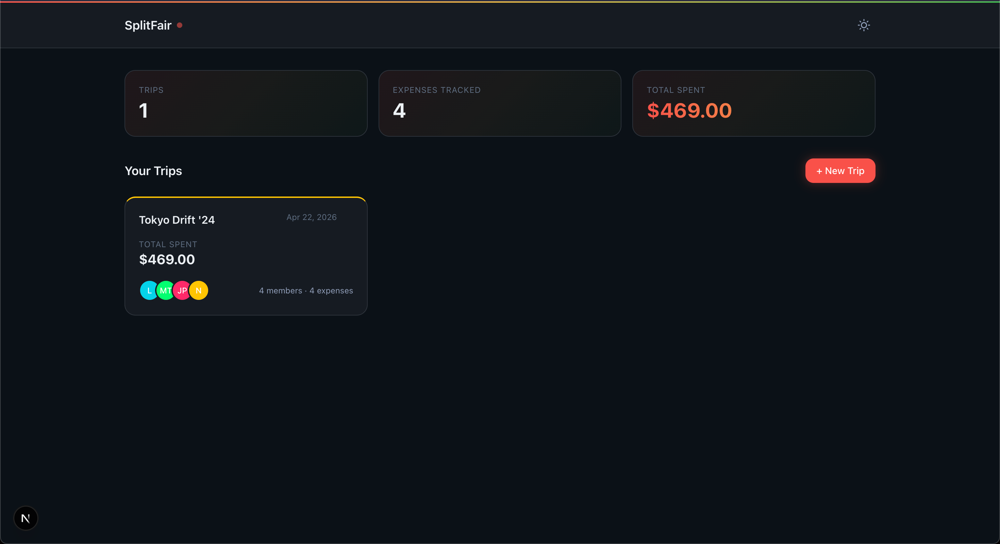
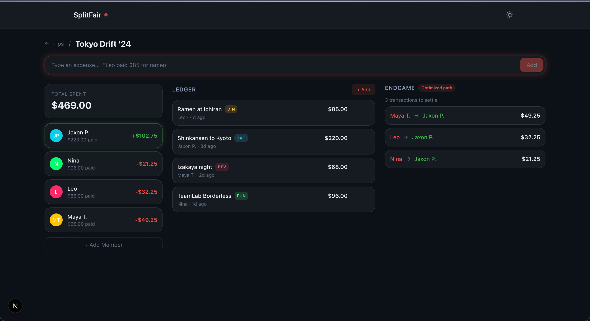

# SplitFair

Fair expense splitting for group trips. Add expenses through a structured form or natural language, compute who owes whom, and get an optimized settlement plan that minimizes the number of repayment transactions.

Built as a CS485 programming assignment demonstrating AI-assisted development with a runtime AI feature.

## Screenshots

  

  

## Features

- **Multi-trip management** — create and manage multiple named trips, each with its own members and expenses
- **Dual expense entry** — structured form or natural language input ("Justin paid $60 for dinner for everyone")
- **Balance calculation** — computes net balances (total paid minus total share) for each member
- **Optimized settlement** — greedy algorithm minimizes the number of repayment transactions
- **Partial participation** — split expenses among a subset of trip members
- **Light/dark theme** — toggle between themes, preference persists across sessions
- **Responsive design** — works on desktop and mobile

## Tech Stack

- **Next.js 16** with App Router and React 19
- **Bun** as the JavaScript runtime and package manager
- **TypeScript** in strict mode
- **Tailwind CSS v4** with CSS custom properties for theming
- **Gemini 2.5 Flash** for natural language expense parsing
- **Vitest** + Testing Library for tests
- **Biome** for linting and formatting

## How It Works

1. Create a trip and add members
2. Add expenses via form or natural language
3. View per-member balances (paid, owed, net)
4. View optimized settlement plan (who pays whom, how much)

All data is stored in your browser's localStorage — no server, no accounts, no sync.
